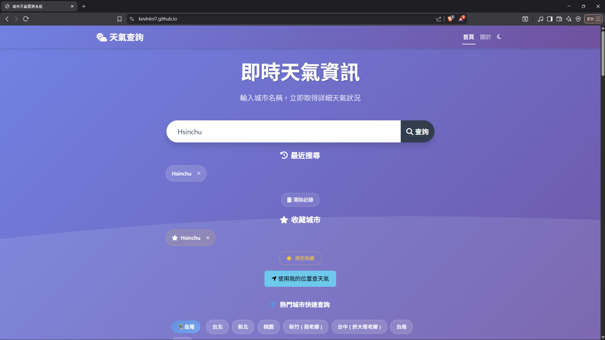

# KevlnlOl7.github.io

## 專案

| 項目         | 內容                                                                                      |
|------------------|---------------------------------------------------------------------------------------|
| 專案名稱      | 晴雨報馬仔（Weather Dashboard）                                                     |
| 組員          | 張傢寧 ( 412630153 ) 、 許方彥 ( 412631508 ) |
| 主要功能      | - 即時全球城市天氣查詢<br>- 五日氣溫預報 + 折線圖<br>- AQI 空氣品質查詢<br>- 地圖定位<br>- 收藏城市、熱門城市、歷史紀錄   |
| 技術/架構       | HTML5、CSS3、Bootstrap 5、JavaScript、Chart.js、OpenWeatherMap API、Google Maps API           |
| 介面特色       | - 在日光模式下 Hero Section 搜尋欄背景會根據當前天氣自動變換主色系：晴天紫色、多雲灰色、下雨藍色<br>- 卡片化資訊與動畫效果:<br>- 深色模式 |
| 進階特色       | - localStorage 記憶( 最近搜尋、收藏城市 )<br>- 自訂主題色動態切換<br>- 支援深色模式<br>- 多模組 CSS 管理<br>- 可擴充性高<br>- 完整支援 RWD            |
| 展示截圖     |                            |
| GitHub Pages | https://kevlnlol7.github.io/        |          |


## 檔案結構
``` txt
114_web_midterm_project/
│
├── index.html                          # 主頁
├── script.js                           # 主程式
├── Styles/                             # styles.css 模組化，實在是太長了
│    └─ globalVarible.css               # 全域變數 :root
│    └─ headerAndHero.css               # 頁頭跟Hero
│    └─ weatherAnimationAndBar.css      # 天氣的動畫以及搜尋bar
│    └─ recommandAndSearch.css          # 精選城市，必有電詐園區：P
│    └─ weatherAndMap.css               # 天氣資訊以及估狗地圖
│    └─ forecast.css                    # 五日預報
│    └─ aqi.css                         # 空氣品質AQI
│    └─ aboutFooterAndAnimation.css     # 關於、頁腳、動畫
│    └─ feedback.css                    # 回饋表單
│    └─ rwd.css                         # 響應式設計，我連三星 Galaxy Fold 5 也有考慮到，也有考慮到切成橫置的情境。
├── README.md                           # 專案說明文件
└── screenshots/                        # 截圖資料夾


